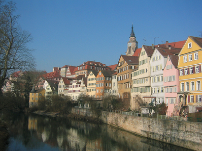
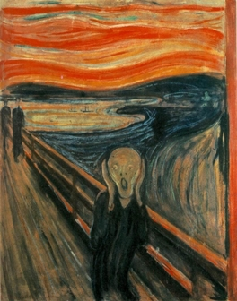
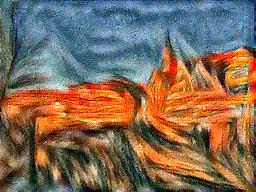

# Style-transfer
An end to end tool for artistic style transfer using neural networks.

**Original Image:**

**Style Image:**

**Result:**

# How it Works:
We take two images, and produce a new image that reflects the content of one but the artistic "style" of the other. This is done by using loss functions that match the content and style of each respective image in the feature space of a deep network, and then performing gradient descent on the pixels of the image itself.
The resulting image is also regularized to ensure smoothness.
This is an implementation of the method found in  [this paper.](https://www.cv-foundation.org/openaccess/content_cvpr_2016/papers/Gatys_Image_Style_Transfer_CVPR_2016_paper.pdf)

SqueezeNet, a DNN model that has been trained on ImageNet is used as a feature extractor.It offers small size and efficiency.

**Requirements:** 
* Tensorflow 2
* Scipy>1.16
* Numpy

**How to use it:**
* In the run.py main function, set the paths of the source image and the style image.
* Set the path where you wsnt the result to be stored.
* Execute the run.py script
* Voila! Now try changing the hyperparameters in the main function ;)
